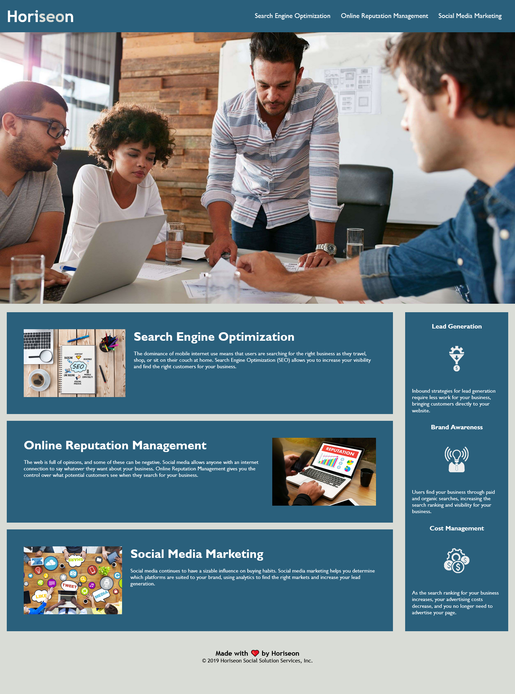

# Code Refactor for Horiseon Social Solution Services, Inc.

## Description
The purpose of this project is to update Horiseon's web-site to improve key aspects in order be to more accessible to people with disabilities, without materially affecting the appearance or functioning of the site.  Improvements, such as how the site loads and displays visually and featuring "alt" definitions with each of the images will be implemented in such a manner as to strengthen Horiseson's position in on-line search engines.  This includes a more meaningful title for their homepage, which was updated to reflect their full corporate name.  By doing so, the combination of "Social Solution Services" should be more easily and quickly recognized in industry specific web searches.

Coding must also be revised to remove redundancies in either or both the HTML and CSS files and create a more distinct outline for each section of the HTML to more clearly define what they represent and enable other collaborators who work on this website to more easily follow the code.

The current appearance of the web-site: 

## Credits and external Resources
.   For a full description of Horiseon's requirements, please visit the [Module 1 Challenge Project Page](https://courses.bootcampspot.com/courses/1181/assignments/23346?module_item_id=458708).  
.   Original source code cloned from [Designated Repository](https://github.com/coding-boot-camp/urban-octo-telegram).  
.   [GIMP](https://www.gimp.org) image manipulation and image editing open source software used for photo-editing. 

## Requirements
No special requirements 

## Deployment
This site has been published via [Github Pages](https://lnd4812.github.io/code-refactor-challenge/) 
The repository has been stored on [Github]([https://github.com/lnd4812/code-refactor-challenge).

## Design
Initial review of original source code and launch of website both indicated several problems in display, including load time, and functionality outside of accessibility issues.

A total of 10 commits  to GitHub comprise the range of changes made to meet the Acceptance Criteria this project; specific details of all changes added through each commit are accessible via the Commit History on [GitHub](https://github.com/lnd4812/code-refactor-challenge.git).

It was also noted that other aspects of the website not specified in the Acceptance Criteria could be better optimized for accessibility purposes.  The following revisions have also been made for Horiseon's consideration and potential acceptance: 
.   The **header**, **main** and **aside** sections all had backgrounds of slightly different shades of blue which seemed (to me) slightly incompatible with each other.  
    Revision(s) - changed background colour of Services **main** and Benefits **aside** to match "header": #2a607c.
.   Black of icon images in **aside** would be difficult to see against the blue background by some users with seeing disabilities.
    Revision(s) - changed colour of icons from black to white,updating  tags accordingly in style.css.
.   Bottom margins of **main** and **aside** sections were noted to be uneven and therefore (to me), somewhat discordant visually.
    Revision(s) - created **section** with a class of * *container* * to include both sections as sub-sections, adjusted bottom margin and spacing of **aside** to match bottom margin of **main** when viewed at 786px.  I think this may also make it easier to adjust when site updated to be responsive when viewed in other platforms or screen sizes.

A complete list of all revisions to date may also be reviewed in the following document: [Summary of main revisions](./assets/Revisions made.docx)

Updated appearance of Horiseon's website: 

## Roadmap
1.  Include coding to enable responsive web-site that can be viewed on other platforms or screen size in addition to 76 8px.

