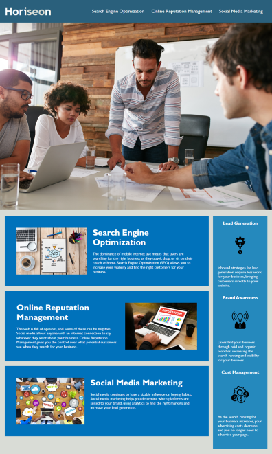

# Code Refactor for Horiseon Social Solution Services, Inc.

## Description
The purpose of this project is to improve key aspects of Horiseon's website so that it may be more accessible to people with disabilities.  At the same time, revisions applied to accomplish this must retain the relative appearance and functioning of the site.  Improvements, including, but not limited to, how the site loads and displays visually and featuring "alt" definitions with each of the images, should also be implemented in such a manner as to strengthen Horiseson's position in on-line search engines.  This also indicates the need for a more meaningful title for their homepage, which was updated to reflect their full corporate name.  By doing so, the combination of "Social Solution Services" should be more easily and quickly recognized in industry related web searches.

Coding must also be revised to remove repetition or redundancies in either or both the HTML and CSS files and create a more distinct outline for each section of the HTML to more clearly define what they represent.  This will enable other collaborators who may want to work on this website to more easily follow the code.

The current appearance of the website: 

## Requirements
No special requirements 

## Built With
-   HTML
-   CSS

## Deployment
This site has been published via [Github Pages](https://lnd4812.github.io/code-refactor-challenge/).
The repository has been stored on [Github](https://github.com/lnd4812/code-refactor-challenge.git).

## Design
Initial review of original source code and launch of website both indicated several problems in display, including load time, and functionality outside of accessibility issues.

The first 10 commits to GitHub comprise the range of main changes made to meet the Acceptance Criteria for this project;  specific details of all changes added through each commit are accessible via the Commit History on [GitHub](https://github.com/lnd4812/code-refactor-challenge.git).

It was also noted that other aspects of the website not specified in the Acceptance Criteria could be better optimized for accessibility purposes.  The following revisions have also been made for Horiseon's review and consideration:
-   The **header**, **main** and **aside** sections all had backgrounds of slightly different shades of blue which seemed (to me) slightly incompatible with each other.  
    Revision(s) - changed background colour of Services **main** and Benefits **aside** to match "header": #2a607c.
-   Black of icon images in **aside** would be difficult to see against the blue background by some users with sight disabilities.
    Revision(s) - changed colour of icons from black to white,updating  tags accordingly in style.css.
-   Bottom margins of **main** and **aside** sections were noted to be uneven and therefore (to me), somewhat discordant visually.
    Revision(s) - created **section** with a class of * *featuring* * to include both sections as sub-sections, adjusted bottom margin and spacing of **aside** to match bottom margin of **main** when viewed at 786px.  

A complete list of all revisions to date may also be reviewed in the following document: [Summary of main revisions](./assets/Design-revisions-made).   

## License
[License](/LICENSE).

## Credits and external Resources
-   A full description of Horiseon's criteria is outlined here: [Module 1 Challenge Project Page](https://courses.bootcampspot.com/courses/1181/assignments/23346?module_item_id=458708).  
-   Original source code cloned from [Designated Repository](https://github.com/coding-boot-camp/urban-octo-telegram).  
-   [GIMP](https://www.gimp.org) image manipulation and image editing open source software used for photo-editing. 

## Task list
[ ] Update to a more responsive website that can be viewed on other platforms, devices and/or screen sizes in addition to 768px.

## Contribution
Laurel David (github.com/lnd4812)

## Contact Information
For any questions, comments and/or issues, please contact me at email: laureldavid64@gmail.com

